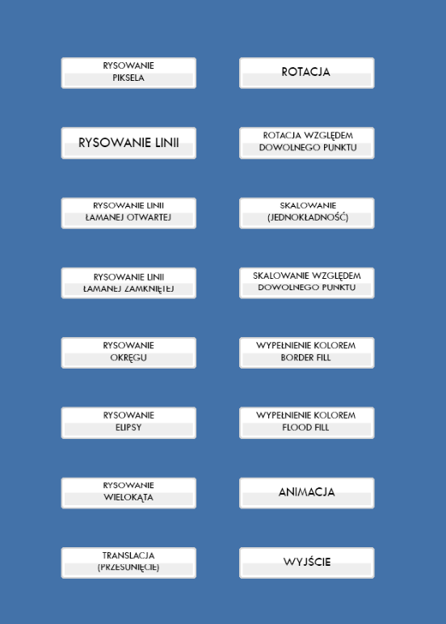
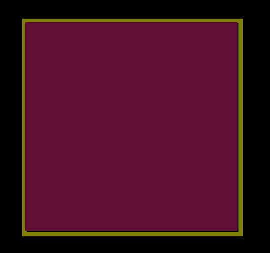
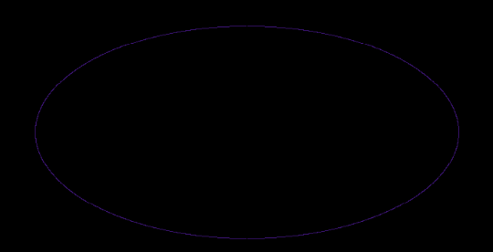

# 2D Graphic Engine
Simple 2D graphic engine which allows to draw primitives, make translations, scalling, rotations and fill objects with color. Engine developed in 2021.

## Technologies Used
### Languages
- C++
### Libraries
- Allegro 5.2 – drawing to screen

## Example Screenshots
### Menu

### Color Fill

### Drawing Ellipse

## Installation
Allegro 5 library needs to be installed before starting the application. It can be downloaded from [authors site.](https://liballeg.org/)
